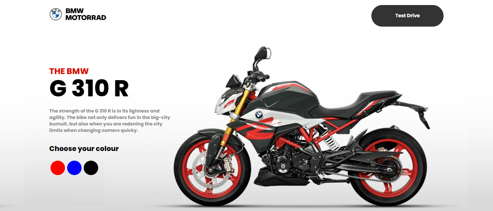
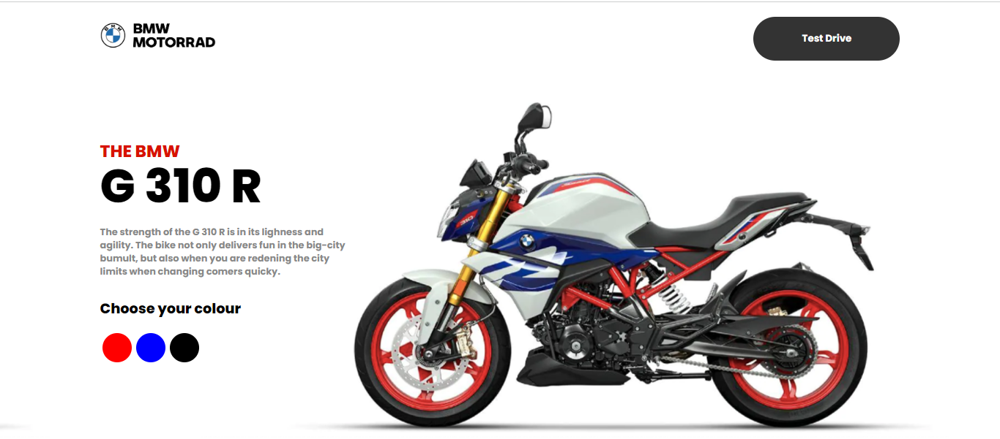

# Demostração do site:

Ao clicar nos círculos de cores mostradas no site, o usuário poderá ter uma prévia de como a moto ficará nessa cor.

 `Exemplo:`
  - clicando na cor azul ficará com essa estilização:`

<blockquote>
    
<strong>Observação:</strong> Site responsivo!

</blockquote>

### Tecnólogias ultilizadas
  

### Informações de contato:

  

